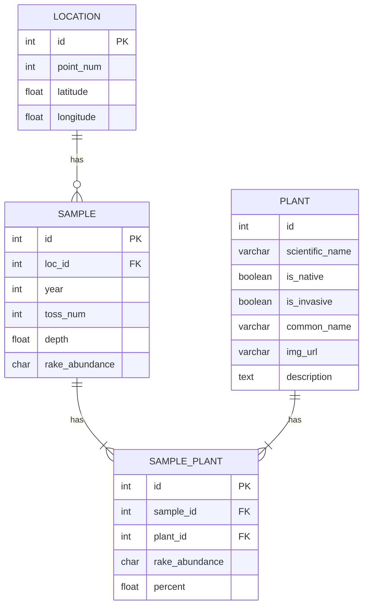

# Rake Toss Data Cleaning

My work cleaning data from a series of Excel files to create uniform CSVs that I can work with across the files.

The data is from an aquatic plant survey conducted on Cazenovia Lake annually.

My intention is to use it for data visualization projects and eventually integrate it into a database with data from all the studies conducted on Cazenovia Lake in recent years.

## ERD draft, if I was making a database for the rake toss only

[Mermaid Diagram](https://mermaid.js.org/)

